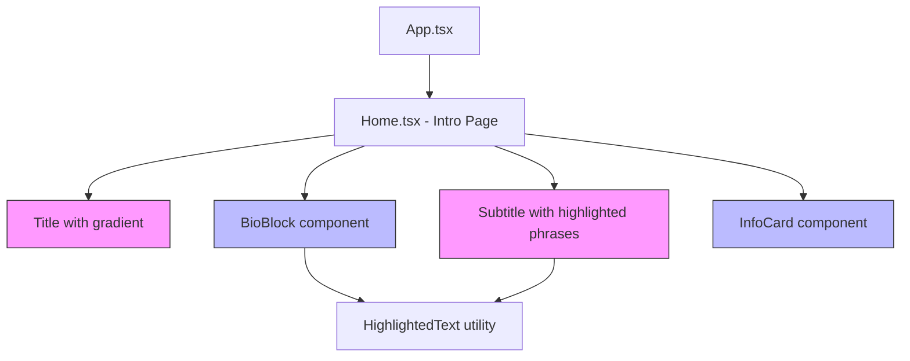

# Design Document: Section Content Update

## Overview

This design covers the refactoring of the Woochive Intro page (`/` route) from its current structure into a new layout with gradient-styled title, highlighted subtitle phrases, a 3-line bio block with color-coded keywords, and an info card component. The existing keyword tags section is removed entirely.

The current `Home.tsx` page uses a simple text-based layout with `introData` from a static data file. The redesign introduces:
- A left-to-right gradient on the title using `#717E87` → `#D57FF4`
- Inline color highlights on specific subtitle and bio phrases
- A new `InfoCard` sub-component for affiliation/contact
- Removal of the `TagList` / "Research Keywords" section

The existing `HeroSection.tsx` component is **not used** by the current Home page (it's a generic reusable hero). The Home page has its own `intro__hero` section in `Home.css`. This redesign modifies the Home page directly without changing the generic `HeroSection` component.

## Architecture



### Key Architectural Decisions

1. **Inline components over new files**: The `BioBlock` and `InfoCard` are small enough to live as local components within `Home.tsx`, or as lightweight separate files. Given the project already has a flat component structure, we'll create `InfoCard.tsx` as a standalone component (it has its own styling concerns) and keep the bio block inline in `Home.tsx`.

2. **CSS highlight approach**: Rather than a generic "highlighted text" component with complex prop APIs, we use CSS utility classes (`.highlight--gray`, `.highlight--purple`, `.highlight--gradient`) applied to `<span>` elements. This keeps the JSX readable and the styling declarative.

3. **Data model update**: The `introData` structure will be simplified — `keywords` array is removed, `bio` becomes structured (array of lines with highlight metadata), and `contact` is replaced by a simpler info card data shape.

4. **No changes to HeroSection.tsx or Navigation.tsx**: The current Home page doesn't use `HeroSection` — it has its own layout. Navigation already has "Intro" as the first nav item pointing to `/`. No navigation changes needed.

## Components and Interfaces

### Modified: `Home.tsx`

The page component is refactored to render the new layout:

```tsx
// New structure
<main className="intro">
  <section className="intro__hero container">
    <h1 className="intro__title">{/* gradient title */}</h1>
    <p className="intro__tagline">{/* highlighted subtitle */}</p>
  </section>

  <section className="intro__bio container">
    {/* 3-line bio block with highlights */}
  </section>

  <section className="intro__info container">
    <InfoCard />
  </section>
</main>
```

**Removed sections:**
- `intro__keywords` (Research Keywords heading + TagList)
- `intro__contact` (replaced by InfoCard)

### New: `InfoCard.tsx`

```tsx
interface InfoCardProps {
  affiliation: string;
  email: string;
  links: Array<{ label: string; href: string }>;
}
```

A card component with `paper-2` background and `border-soft` border, displaying affiliation, email (plain text), and external links.

### New: CSS utility classes for highlights

Added to `Home.css`:

```css
.highlight--gray { color: #717E87; }
.highlight--purple { color: #D57FF4; }
.highlight--gradient {
  background: linear-gradient(90deg, #717E87 0%, #D57FF4 100%);
  -webkit-background-clip: text;
  -webkit-text-fill-color: transparent;
  background-clip: text;
}
```

### Modified: `src/data/intro.ts`

The data file is updated to remove `keywords` and restructure for the new layout:

```tsx
export const introData = {
  title: 'Woochive',
  subtitle: 'A personal archive for music data research, mathematical foundations, and creative works.',
  bio: [
    { text: 'I study Applied Mathematics.', highlights: [{ phrase: 'Applied Mathematics', color: 'gray' }] },
    { text: 'I research Music Information Retrieval, DSP, TDA, and Image Processing.', highlights: [...] },
    { text: 'I listen to live music, make music, and archive the sounds that shape my world.', highlights: [...] },
  ],
  infoCard: {
    affiliation: 'Undergraduate Researcher at Korea University, Sejong',
    email: 'sonluos1013@gmail.com',
    links: [
      { label: 'GitHub', href: 'https://github.com/sonluos' },
      { label: 'LinkedIn', href: 'https://www.linkedin.com/in/woojin-son-541705267' },
    ],
  },
};
```

### Modified: `src/types/archive.ts`

```tsx
export type HighlightColor = 'gray' | 'purple' | 'gradient';

export interface TextHighlight {
  phrase: string;
  color: HighlightColor;
}

export interface BioLine {
  text: string;
  highlights: TextHighlight[];
}

export interface InfoCardData {
  affiliation: string;
  email: string;
  links: Array<{ label: string; href: string }>;
}

export interface IntroData {
  title: string;
  subtitle: string;
  bio: BioLine[];
  infoCard: InfoCardData;
}
```

Note: The `keywords` and `contact` fields are removed from `IntroData`.

## Data Models

### HighlightColor

A union type representing the three highlight styles:
- `'gray'` → applies `color: #717E87`
- `'purple'` → applies `color: #D57FF4`
- `'gradient'` → applies the left-to-right gradient via `background-clip: text`

### BioLine

Each line in the bio block is represented as:
- `text`: The full line string
- `highlights`: Array of phrases within that text to highlight, each with a color

### Rendering logic for highlighted text

A utility function `renderHighlightedText(text: string, highlights: TextHighlight[])` splits the text at highlight boundaries and wraps matched phrases in `<span>` elements with the appropriate CSS class. Non-highlighted text renders with the default `ink-soft` color.

```tsx
function renderHighlightedText(text: string, highlights: TextHighlight[]): React.ReactNode {
  if (highlights.length === 0) return text;
  
  // Sort highlights by their position in the text
  const sorted = [...highlights].sort(
    (a, b) => text.indexOf(a.phrase) - text.indexOf(b.phrase)
  );
  
  const parts: React.ReactNode[] = [];
  let lastIndex = 0;
  
  sorted.forEach((h, i) => {
    const start = text.indexOf(h.phrase, lastIndex);
    if (start === -1) return;
    
    if (start > lastIndex) {
      parts.push(text.slice(lastIndex, start));
    }
    parts.push(
      <span key={i} className={`highlight--${h.color}`}>{h.phrase}</span>
    );
    lastIndex = start + h.phrase.length;
  });
  
  if (lastIndex < text.length) {
    parts.push(text.slice(lastIndex));
  }
  
  return parts;
}
```

### CSS Variable Integration

The design leverages existing CSS variables:
- `--gradient-brand` is already defined as `linear-gradient(135deg, #717E87 0%, #D57FF4 100%)` — but the title needs a **left-to-right (90deg)** gradient at 50/50 ratio, so we define a new variable or use inline gradient.
- `--paper-2`, `--border-soft` for the InfoCard background/border (matching existing card patterns like `intro__about`).
- `--ink-soft` for default text color.
- `--font-sans` for the bio block font.

New CSS variable added to `variables.css`:
```css
--gradient-title: linear-gradient(90deg, #717E87 0%, #D57FF4 100%);
```

## Correctness Properties

*A property is a characteristic or behavior that should hold true across all valid executions of a system-essentially, a formal statement about what the system should do. Properties serve as the bridge between human-readable specifications and machine-verifiable correctness guarantees.*

### Property 1: Highlighted text rendering preserves full content

*For any* text string and any set of highlight annotations, the rendered output of `renderHighlightedText` SHALL contain all characters from the original text in their original order, regardless of how many highlights are applied.

**Validates: Requirements 2.1, 3.1, 3.2, 3.3, 3.4**

## Error Handling

This feature is primarily presentational with static content. Error scenarios are minimal:

1. **Missing highlight phrase**: If a highlight phrase doesn't exist in the text string, the `renderHighlightedText` function skips it gracefully (the `indexOf` check handles this).
2. **Empty bio lines**: If `bio` array is empty, the bio section renders nothing — no crash.
3. **Missing link hrefs**: The InfoCard links are hardcoded in the data file. If a link has an empty href, the anchor still renders but navigates nowhere. This is acceptable for static data.
4. **CSS fallback**: If `background-clip: text` is unsupported (very old browsers), the text falls back to the gradient background being visible behind the text. The `-webkit-` prefix ensures broad support.

## Testing Strategy

### Why Property-Based Testing Does NOT Apply

This feature consists of:
- Static UI rendering with fixed content
- CSS styling (gradients, colors)
- DOM structure verification
- Responsive layout

All acceptance criteria test specific, fixed outputs — not universal properties across varying inputs. There is no meaningful input space to randomize. PBT is not appropriate here.

### Unit Testing Approach

Use **Vitest + @testing-library/react** (already configured in the project):

1. **Content rendering tests**:
   - Title "Woochive" is rendered with gradient class
   - Subtitle contains all expected text
   - Each highlighted phrase has the correct CSS class
   - Bio block renders 3 lines with correct highlights
   - InfoCard displays affiliation, email, and links

2. **Link behavior tests**:
   - GitHub link has correct `href`, `target="_blank"`, `rel="noopener noreferrer"`
   - LinkedIn link has correct `href`, `target="_blank"`, `rel="noopener noreferrer"`
   - Email is rendered as plain text (not a link)

3. **Removal verification tests**:
   - No "Research Keywords" heading in the DOM
   - No TagList component rendered
   - No keyword tag elements present

4. **Layout order tests**:
   - DOM order: title → subtitle → bio → info card
   - Title and subtitle are within a center-aligned container

5. **Utility function tests**:
   - `renderHighlightedText` correctly splits text and applies highlight classes
   - Handles edge cases: no highlights, phrase not found, overlapping phrases

### Visual/Manual Testing

- Verify gradient rendering across browsers (Chrome, Firefox, Safari)
- Verify responsive breakpoint at 768px
- Verify dark mode gradient adaptation (uses existing `--gradient-brand` dark mode override pattern)
